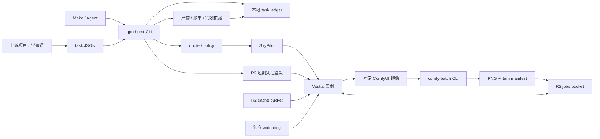

# gpu-burst 技术文档

> 状态：目标架构 + Phase 1 本地骨架。仓库已有本地 CLI、schema、ledger、quote 和测试；云端 provider、R2 探针、ComfyUI 执行仍未实现。
>
> 更新日期：2026-07-10

## 1. 技术目标

gpu-burst 为低频、长时间、GPU 密集的个人批处理任务提供统一控制面：

- 在本地与 Vast.ai 之间做显式执行决策；
- 把云端创建、准备、执行、回传、销毁和计费关联到一个 task_id；
- 逐项保存状态，使任务在进程中断或实例失败后只重跑缺失单元；
- 对安全、预算、凭证和公开发布设置不可绕过的边界；
- 复用现有 workload 仓库，不在控制面重复领域和模型逻辑。

第一阶段只支持 `song-cards`，使用 [comfy-batch](https://github.com/makoshan/comfy-batch) 作为 workload adapter。

## 2. 技术栈与版本策略

| 组件 | 第一阶段选择 | 约束 |
|---|---|---|
| Python | 3.13 | SkyPilot 当前稳定路径不支持本机默认 Python 3.14 |
| 环境管理 | uv | 生成锁文件，禁止云机现场解析未固定依赖 |
| CLI | Typer | 命令与退出码必须可供人、cron 和 Agent 共同使用 |
| Schema | Pydantic v2 | task、item、quote、ledger 使用同一模型定义 |
| 测试 | pytest | live 云测试必须显式 opt-in，默认测试不得产生费用 |
| 调度 | `skypilot[vast]==0.12.3.post1` | 不使用 0.13.0rc；升级需重新跑 hello-world 与故障演练 |
| Vast 客户端 | vastai-sdk / Vast API | 用于实际 offer 与销毁状态核验，不读取或打印 key |
| 对象同步 | s5cmd | 使用 R2 S3 兼容端点和短期凭证 |
| 容器 | Docker / OCI image | 生产运行只使用 digest，不使用浮动 tag |
| workload | comfy-batch 固定 commit | 只运行 CLI，不部署 dashboard |

版本升级遵循“一次只改变一个变量”：控制面、镜像、ComfyUI、节点、模型和 workload commit 不在同一次基准运行中同时升级。

## 3. 系统边界



### 3.1 控制面：gpu-burst

负责：

- 配置与凭证存在性检查；
- task schema 校验、task_id 与幂等键生成；
- 本地/云端计划与报价；
- SkyPilot 生命周期；
- R2 短期凭证、输入输出路径和同步命令；
- ledger、日志、成本和销毁验证；
- workload adapter 的启动、退出码与产物验收。

不负责：

- song-cards prompt 的领域生成与审核；
- ComfyUI 工作流节点细节；
- 图片是否适合学习内容的最终判断；
- 自动公开发布。

### 3.2 workload adapter：comfy-batch

负责：

- 把标准 item 转成 ComfyUI prompt graph；
- 选择 FLUX/Qwen/LoRA 工作流；
- 提交 prompt、解析 history、下载图片；
- 每个 item 返回明确成功或失败；
- 接受固定 output key 与 resume manifest。

第一阶段需要先补齐以下契约，才可作为云 job：

- ComfyUI history 出现 prompt_id 不等于成功，必须解析执行状态和 node error；
- required item 缺件时进程必须非零退出；
- 每项使用稳定 item_id 和幂等键；
- 重跑只跳过经过输入/模型/参数哈希验证的完成项；
- label 必须净化，不能直接成为任意文件路径；
- CLI 与 dashboard 不能各维护一套工作流定义；
- dashboard 不进入云端 MVP。

### 3.3 数据面：R2

R2 只保存可追踪的对象，不作为隐式共享文件系统。Vast 后端不支持对象存储挂载，所有输入输出都显式同步。

## 4. 目标仓库结构

```text
gpu-burst/
├── pyproject.toml
├── uv.lock
├── src/gpu_burst/
│   ├── cli.py                 # Typer 命令入口
│   ├── config.py              # 本地非密钥配置与路径
│   ├── doctor.py              # 工具、版本、凭证、Docker 与网络检查
│   ├── manifests.py           # task/item/quote/actual schema
│   ├── lifecycle.py           # 状态机与转换规则
│   ├── ledger.py              # 本地 JSON/JSONL 原子写入
│   ├── quote.py               # 本地/云端成本和耗时估算
│   ├── redaction.py           # 日志密钥脱敏
│   ├── providers/
│   │   ├── skypilot.py        # launch/status/logs/down
│   │   └── vast.py            # offer、费用与销毁核验
│   ├── storage/
│   │   ├── r2.py              # 短期凭证、路径与 s5cmd
│   │   └── layout.py          # bucket/key 规范
│   ├── safety/
│   │   └── watchdog.py        # 超时实例独立核验与销毁
│   └── workloads/
│       ├── base.py            # adapter protocol
│       └── song_cards.py      # comfy-batch adapter
├── tasks/
│   └── song-cards.example.json
├── sky/
│   └── song-cards.yaml
├── images/
│   └── comfy-batch/
│       ├── Dockerfile
│       └── model-manifest.json
├── tests/
│   ├── unit/
│   ├── contract/
│   └── live/
└── docs/
    ├── product.md
    └── technical.md
```

## 5. 配置与秘密

### 5.1 本地配置

非密钥配置放在 `~/.config/gpu-burst/config.toml`：

```toml
[provider.vast]
datacenter_only = true
max_hourly_cost_usd = 0.80
default_gpu = "RTX4090"

[storage]
cache_bucket = "gpu-burst-cache"
jobs_bucket = "gpu-burst-jobs"
endpoint = "https://<ACCOUNT_ID>.r2.cloudflarestorage.com"

[safety]
autodown_idle_minutes = 10
watchdog_interval_minutes = 5
max_unverified_age_minutes = 20
```

示例中的 `<ACCOUNT_ID>` 是文档占位符，不得把真实 account ID 或任何 secret 提交到仓库。

### 5.2 长期凭证

- Vast key：`~/.config/vastai/vast_api_key`；
- R2 parent credential：仅存在于本地可信环境或最小签发服务；
- credential 文件权限应限制为当前用户；
- `doctor` 只输出 `present / missing / invalid`，不得输出值、前后缀或可用于恢复的片段。

当前实现会解析并校验 TOML，拒绝空 Vast key，并要求 key 文件不得向 group/other 开放任何权限。它只核验本地语义和权限；远端 Vast/R2 API 可用性探针仍属于 live provider 阶段。

### 5.3 云机短期凭证

song-cards 实例需要三组短期权限：

1. `gpu-burst-cache` 只读，用于模型与节点资源；
2. `gpu-burst-jobs` 的任务输入前缀只读；
3. `gpu-burst-jobs` 的任务输出前缀只写。

短期凭证 TTL 为 `预计最长任务时间 + 30 分钟`，不得超过任务硬超时。`dialect-archive` 的任何凭证都不发送到 song-cards 云机。

## 6. Task 规范

第一版 task 文件使用 JSON，schema_version 固定为 `1`：

```json
{
  "schema_version": 1,
  "workload": "song-cards",
  "profile": "fast",
  "runtime": {
    "workload_repo": "makoshan/comfy-batch",
    "workload_commit": "61db1c4840e739516647fce867e44a4ef563baff",
    "image_digest": "sha256:example-image-digest",
    "workflow_digest": "sha256:example-workflow-digest",
    "model_manifest_digest": "sha256:example-model-manifest-digest"
  },
  "resources": {
    "gpu": "RTX4090",
    "gpu_count": 1,
    "min_gpu_memory_gb": 24,
    "min_system_memory_gb": 32,
    "disk_gb": 80,
    "datacenter_only": true,
    "max_hourly_cost_usd": 0.80
  },
  "budget": {
    "max_total_usd": 3.00,
    "max_wall_seconds": 1800
  },
  "items": [
    {
      "item_id": "song-card-0001",
      "prompt": "A flat screen-print illustration on a simple blue background.",
      "seed": 42,
      "required": true,
      "output_key": "items/song-card-0001.png"
    }
  ]
}
```

示例 digest 不是可运行值。`doctor` 和 schema 校验必须拒绝包含 `example-` 的 runtime digest 进入付费运行。

### 6.1 task_id

task_id 由调用方标签和随机后缀构成，示例：`song-cards-20260710-230501-a1b2c3`。它用于关联本地 ledger、SkyPilot cluster、Vast label 和 R2 前缀。

task_id 不承担幂等判断。幂等由 item key 决定：

```text
item_key = sha256(
  workload
  + canonical_item_json
  + workload_commit
  + image_digest
  + workflow_digest
  + model_manifest_digest
)
```

### 6.2 Profile

| Profile | workload 映射 | 第一阶段状态 |
|---|---|---|
| `fast` | FLUX.1-dev GGUF Q4 | 唯一允许付费运行的 profile |
| `quality` | Qwen-Image GGUF Q4，文本编码器 CPU offload | schema 保留，运行时拒绝 |
| `style` | FLUX Q4 + 固定 LoRA | schema 保留，运行时拒绝 |

每个 profile 同时定义 GPU 显存、系统内存、模型集合、warmup 和预计单项耗时，不只是模型名称别名。

## 7. Manifest 与状态机

### 7.1 Task 状态

```text
CREATED
→ VALIDATED
→ QUOTED
→ PROVISIONING
→ PREPARING
→ RUNNING
→ UPLOADING
→ VERIFYING
→ TEARING_DOWN
→ SUCCEEDED | FAILED | DEGRADED | FAILED_TEARDOWN
```

- `DEGRADED` 只允许 optional item 失败；
- required item 失败必须是 `FAILED`；
- 产物成功但销毁未确认必须是 `FAILED_TEARDOWN`，不能写 `SUCCEEDED`；
- 终态只能追加新审计事件，不回写历史事件。

### 7.2 Item 状态

```text
PENDING → QUEUED → RUNNING → COMPLETE | FAILED
PENDING → SKIPPED_VERIFIED
```

`SKIPPED_VERIFIED` 需要同时满足：

- item_key 完全相同；
- 目标对象存在且大小大于 0；
- PNG 解码成功；
- manifest 中的 SHA-256 与下载或 HEAD metadata 一致；
- 上一次运行没有标记该产物为 rejected。

### 7.3 Manifest 示例

```json
{
  "task_id": "song-cards-20260710-230501-a1b2c3",
  "task_state": "RUNNING",
  "created_at": "2026-07-10T15:05:01Z",
  "quote_usd": 0.42,
  "budget_usd": 3.00,
  "provider": {
    "name": "vast",
    "cluster_name": "gb-song-cards-a1b2c3",
    "instance_id": "provider-instance-id"
  },
  "items": {
    "song-card-0001": {
      "state": "COMPLETE",
      "item_key": "sha256:item-key",
      "prompt_id": "comfy-prompt-id",
      "output_key": "tasks/song-cards-20260710-230501-a1b2c3/items/song-card-0001.png",
      "sha256": "sha256:output-digest",
      "attempts": 1,
      "duration_seconds": 21.4
    }
  }
}
```

## 8. Ledger 与 R2 布局

### 8.1 本地 ledger

```text
~/.local/share/gpu-burst/tasks/<task_id>/
├── task.json
├── quote.json
├── events.jsonl
├── manifest.json
├── actual-cost.json
├── stdout.log
└── stderr.log
```

`events.jsonl` 采用追加写、flush、fsync。可变快照先写临时文件，再用同文件系统原子 rename 替换。

### 8.2 R2 cache bucket

```text
gpu-burst-cache/
├── models/<model>/<sha256>/...
├── loras/<name>/<sha256>/...
└── comfy-nodes/<snapshot-sha>/...
```

### 8.3 R2 jobs bucket

```text
gpu-burst-jobs/
└── tasks/<task_id>/
    ├── input/task.json
    ├── input/items.jsonl
    ├── output/items/<item_id>.png
    ├── logs/events.jsonl
    ├── manifests/000001-<sha>.json
    ├── manifests/latest.json
    └── billing/actual.json
```

R2 不依赖 S3 bucket versioning。每次 manifest 使用递增序号和内容哈希写新 key，`latest.json` 只是可重建指针。

## 9. 命令行为

### 9.1 doctor

检查：

- Python 3.13 uv 环境；
- `sky`、`vastai`、`s5cmd`、Docker client/daemon；
- SkyPilot、Vast SDK 和 workload 版本；
- Vast、R2 parent credential 与 account ID 是否存在且可用；
- R2 bucket 与最小读写探针；
- 本地可用磁盘；
- 日志脱敏规则。

退出码：

- `0`：付费运行所需检查全部通过；
- `2`：缺少工具或配置；
- `3`：凭证存在但验证失败；
- `4`：版本不兼容；
- `5`：安全策略不满足。

### 9.2 quote

报价输入为已验证 task，输出：

- 匹配 offer 与资源信息；
- GPU、磁盘、上行、下行单价；
- 模型和输入下载字节；
- 冷启动、warmup、运行和回传时间；
- 本地估算、云端估算与推荐 backend；
- 最大总预算和报价有效期。

报价不会创建实例。Vast offer 会变化，因此 quote 只在短时间窗口内有效；run 必须重新核对并拒绝超过硬预算的 offer。

### 9.3 run

执行顺序：

1. 校验 schema、profile、digest 和预算；
2. 写本地 ledger 和 `CREATED/VALIDATED` 事件；
3. 获取新 quote 并执行策略判断；
4. 生成任务输入和三组短期 R2 凭证；
5. 启动带远端 autodown 的 SkyPilot cluster；
6. 通过 Vast API 核验实际 offer；
7. 拉取并校验模型，启动 ComfyUI；
8. 运行独立 warmup，并以真实 history 成功作为 ready；
9. comfy-batch 逐项执行、checkpoint、上传和校验；
10. 上传最终 workload manifest、日志和临时成本摘要；
11. 在 `finally` 中请求 down；
12. 同时核对 SkyPilot 与 Vast 状态；
13. 获取 Vast actual cost；账单延迟时写 `pending_reconciliation` 事件；
14. 根据 required item、回传、预算与销毁结果写终态。

### 9.4 cancel

cancel 先写 `CANCEL_REQUESTED` 事件，再取消 workload、请求 `sky down`，最后通过 Vast API 核验。无法核验销毁时返回非零并保留 watchdog 接管标记。

### 9.5 hello-world

`hello-world --dry-run` 生成 Phase 2 的 SkyPilot 命令计划并写本地 ledger，不创建云资源。输出包含 `launch_args` 与 `down_args`，二者均为参数数组，禁止通过 shell 拼接执行用户输入。

`hello-world --confirm-paid` 必须先满足：

- `GPU_BURST_LIVE=1`；
- `doctor` 返回 `paid_runtime_ready=true`；
- SkyPilot/Vast 本地依赖和凭证检查通过。

当前实现通过参数数组执行 `sky launch`，同时设置 `--idle-minutes-to-autostop <minutes> --down`，并在 finally 路径显式执行 `sky down -y <cluster>`。launch/down 输出不会进入 CLI 错误或 ledger。任务在 teardown 开始前写入 `TEARING_DOWN`，最终写入 `SUCCEEDED` 或 `FAILED`。Vast API 独立销毁复核与账单记录尚未实现，因此仍是 experimental。

### 9.6 watchdog

`watchdog --dry-run` 扫描本地 ledger 中超过 `max_unverified_age_minutes` 的非终态 task，并报告 task_id、状态、更新时间、年龄和 provider 信息。损坏 JSON、缺失或不匹配的 task_id、缺失或无效的时间戳会逐项写入 `scan_errors`，不会中止其他 task 的安全扫描。当前不触碰 Vast API；真实销毁动作留给 live watchdog 实现。

## 10. SkyPilot 与 Vast

### 10.1 资源约束

第一阶段使用：

- on-demand；
- `datacenter_only: true`；
- 单节点、单 GPU；
- `max_hourly_cost`；
- 远端 autodown；
- 不开放公网端口；
- workload 通过 task run command 执行。

SkyPilot 的 Vast 创建路径不能按项目要求精确过滤网速与可靠性。因此 quote 可以预览 Vast offer，但 launch 后仍必须读取实际实例信息，并在不满足硬策略时立即销毁。

### 10.2 安全销毁

采用三层保险：

1. **远端 autodown**：云机自主执行，不依赖本地 CLI 存活；
2. **控制面 finally**：正常、失败、Ctrl-C 都请求 down；
3. **独立 watchdog**：按 task label 查询超龄 Vast 实例并报警或销毁。

销毁 SLA 从 task 进入 `TEARING_DOWN` 开始计时。第一阶段目标为 15 分钟内同时从 SkyPilot 和 Vast 视图消失。

## 11. ComfyUI 执行契约

### 11.1 镜像

镜像包含：

- 固定 ComfyUI commit；
- 固定 ComfyUI-GGUF 与其他 custom node snapshot；
- 匹配的 Python、PyTorch 和 CUDA runtime；
- comfy-batch 固定 commit；
- warmup workflow；
- s5cmd 与校验脚本。

模型和 LoRA 不烤入镜像，按 `model-manifest.json` 从 R2 下载并逐个校验 SHA-256。

### 11.2 Warmup

warmup 是独立阶段，不消耗正式 item：

- 启动 ComfyUI；
- 等待 `/system_stats`；
- 提交最小 FLUX prompt；
- 等待 history；
- 确认无 node error 且产生可解码小图；
- 记录模型加载时长和峰值显存；
- 删除 warmup 输出或放在独立诊断前缀。

### 11.3 成功判定

单项成功需要：

- HTTP 请求成功；
- history 显示 execution success；
- 没有 node error 或 execution interrupted；
- 至少一个预期图片输出；
- 图片下载、PNG 解码和 SHA-256 成功；
- 输出上传 R2 且 HEAD metadata 一致；
- item manifest 已 checkpoint。

任何一步失败都不得打印“Saved”或返回 item success。

## 12. 成本模型

### 12.1 Quote

```text
compute = gpu_hourly_rate × billed_active_hours
disk = disk_rate × allocated_gb × instance_lifetime
network = download_gb × inet_down_rate + upload_gb × inet_up_rate
r2 = storage_delta + class_a_ops + class_b_ops
estimated_total = compute + disk + network + r2
```

运行时间估算：

```text
startup
+ image_pull
+ model_download
+ warmup
+ item_count × profile_seconds_per_item
+ retries
+ output_upload
+ teardown_buffer
```

不使用固定 spot 折扣。第一阶段不使用 spot。

### 12.2 Actual

actual 以 Vast 账单和实例明细为主，R2 增量为辅。任务结束时记录一次，账单延迟时标记 `pending_reconciliation`，后续补写新审计事件，不覆盖原始 quote。

## 13. 故障模型与恢复

| 故障 | 预期行为 | 恢复 |
|---|---|---|
| 本地 CLI 中断 | 远端 autodown 仍生效 | 下次 status 读取 ledger、SkyPilot、Vast 和 R2 重建状态 |
| offer 不满足硬策略 | 不运行 workload | 立即 down，记录拒绝原因和已产生费用 |
| 模型下载中断 | item 尚未开始 | s5cmd 续传或重新下载，SHA 不符则删除损坏文件 |
| warmup 失败 | required item 不入队 | 保存诊断，down，任务失败 |
| 单项 Comfy node error | 只标记该 item 失败 | 按策略重试；达到上限后 required task 失败 |
| 首项冷加载超时 | 不把首项当 warmup | warmup 单独重试，正式 item 不消耗 attempt |
| 输出上传失败 | 本地云盘产物暂存 | 在硬超时内重传；未确认 R2 前不能 complete |
| required item 缺失 | 批次失败 | resume 只补失败 item |
| `sky down` 失败 | `FAILED_TEARDOWN` | watchdog 接管并持续报警 |
| 账单暂不可用 | 产物状态独立保存 | 标记待对账，稍后补写 actual |
| R2 短期凭证过期 | 禁止换长期 key | 任务失败或由可信控制面重新签发最小凭证 |

## 14. 可观测性

所有日志事件使用 JSONL，并包含：

- timestamp、task_id、item_id；
- phase、event、attempt；
- provider、cluster、instance；
- duration、bytes、estimated_cost、actual_cost；
- error_type 与脱敏 message；
- 关联的 artifact key 和 digest。

不得记录：

- API key、secret access key、session token；
- 预签名 URL 的 query string；
- 采访原始音频内容；
- 未经审核的敏感 prompt 或个人信息。

第一阶段不建设远程 dashboard，本地 `status` 和 `logs` 读取 ledger，并按需查询 SkyPilot/Vast/R2。

## 15. 安全与信任边界

- Vast 社区主机不能因为 `datacenter_only` 就视为可信机密计算环境；该选项主要提高基础设施可靠性；
- song-cards 只处理可再生成的 prompt、模型和图片，不接触采访档案凭证；
- `dialect-archive` 与 cache/jobs 使用不同 bucket 和不同 parent credential；
- 对不可再生采访音频，R2 不是唯一备份；需要独立副本和 Bucket Lock；
- 计算成功默认只写私有 jobs bucket；发布到网站是另一个授权动作；
- 所有外部命令使用参数数组，禁止拼接并 `eval` 用户输入；
- task_id、item_id、label 和 output_key 必须经过字符集、长度与路径穿越校验。

## 16. 测试策略

### 16.1 Unit

- schema 接受合法 task，拒绝缺少 digest、预算和 required item 的 task；
- item_key 对 canonical JSON 稳定，对 prompt/seed/model 变化敏感；
- 状态机拒绝非法回退和把 required failure 写成 success；
- quote 覆盖 GPU、磁盘、网络与 R2；
- redaction 删除所有凭证字段和预签名 query；
- 路径校验拒绝 `../`、绝对路径和控制字符。

### 16.2 Contract

- mocked ComfyUI success、node error、interrupted、empty output 和 timeout；
- mocked SkyPilot launch/status/down；
- mocked Vast offer、费用和销毁延迟；
- mocked R2 HEAD、短期凭证过期和上传失败；
- comfy-batch required item 失败时进程非零。

### 16.3 Integration

- 本地 fake provider 完整跑通 manifest、ledger、resume 与 teardown；
- Docker 镜像启动 ComfyUI，并在无云费用条件下跑 warmup fixture；
- R2 使用独立测试前缀，验证三组短期凭证互相不能越权。

### 16.4 Live

live 测试必须同时满足显式命令参数、环境开关和硬预算：

```bash
GPU_BURST_LIVE=1 gpu-burst run --confirm-paid tasks/song-cards.example.json
```

默认 CI、pytest 和文档构建不能触发付费资源。

## 17. 实施阶段

### Phase 1：本地骨架

- Python 3.13 uv 项目；
- schema、ledger、状态机、redaction；
- `doctor` 与 `--dry-run`；
- fake provider 和测试。

当前状态：已实现。完成条件是不需要云凭证即可通过全部 unit/contract 测试并生成可审查 manifest。

### Phase 2：Vast hello-world

- SkyPilot/Vast provider；
- quote 与硬预算；
- remote autodown、finally down、watchdog；
- `nvidia-smi` 及三种故障演练。

当前状态：受保护的 live 生命周期已实现，包括正确的 SkyPilot idle-autostop/down 参数、显式 finally down、清理前状态落盘和净化错误。手工 Vast `nvidia-smi`/ComfyUI 烟测已经成功且实例已销毁；仍需用 CLI 完成真实故障演练、Vast API 销毁复核和账单关联。

完成条件：正常、CLI 中断和远端命令失败均能在销毁 SLA 内确认实例消失。

### Phase 3：song-cards 单张

- 固定 ComfyUI 镜像；
- model manifest 与 R2 同步；
- comfy-batch contract 修复；
- warmup、单项 checkpoint、PNG 验证和账单。

完成条件：同一 task 重跑不会重复生成已验证图片。

### Phase 4：20 张批量

- 逐项失败隔离与 resume；
- quote/actual 对账；
- 完整日志和成本摘要；
- 上游图片质量审核。

完成条件：通过 [产品文档](product.md) Gate D，才评估第二条 workload。

## 18. 已知限制

- 方案尚未产生任何真实 Vast 或 R2 账单；
- SkyPilot Vast 集成是较新的社区维护路径，升级必须重新验证；
- 第一阶段没有 HA 控制面，可靠性依赖远端 autodown 与独立 watchdog；
- R2 显式同步会增加冷启动，是否优于本地必须以 workload 实测判断；
- ComfyUI 和 custom nodes 仍可能存在版本兼容问题，镜像固定只能减少漂移，不能替代 fixture 测试；
- 当前只定义单实例、单 GPU、单 workload；不要从文档推断多租户或多机能力。

## 19. 相关文档

- [README](../README.md)
- [产品文档](product.md)
- [SkyPilot Vast 集成说明](https://vast.ai/article/vast-ai-gpus-can-now-be-rentend-through-skypilot)
- [Cloudflare R2 临时凭证](https://developers.cloudflare.com/r2/api/s3/temporary-credentials/)
- [Cloudflare R2 Bucket Lock](https://developers.cloudflare.com/r2/buckets/bucket-locks/)
- [comfy-batch](https://github.com/makoshan/comfy-batch)
